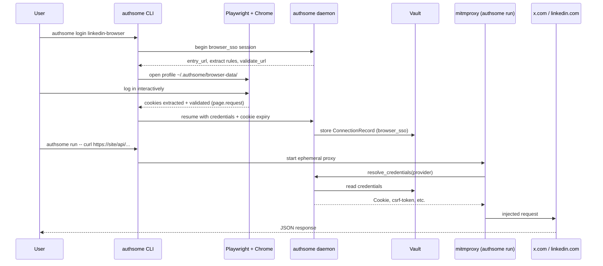

# Browser SSO — PR review guide

**PR:** [#301 — feat: browser sso support](https://github.com/agentrhq/authsome/pull/301)  
**Audience:** reviewers / team leads who don't want to read ~2k lines blind  
**Scope:** internal only — not published to the docs site

---

## TL;DR

This PR adds a new auth path called **Browser SSO**: the user logs in through a real browser, authsome captures session cookies, stores them in the vault, and the existing **mitmproxy** injects the right headers when you run `authsome run -- curl …`.

Bundled providers: **`x-browser`**, **`linkedin-browser`**.

It is implemented natively inside authsome (daemon + vault + proxy), not delegated to an external CLI.

---

## Problem this solves

OAuth and API keys don't cover sites like X and LinkedIn where the useful APIs are the same cookie/session the website uses. Agents need:

1. A one-time (or periodic) browser login
2. Durable cookie storage
3. Automatic header injection on outbound HTTP — without pasting secrets into agent env vars

Before this PR, `authsome list` could show "connected" while `authsome run` failed with `TokenExpiredError` because httpx re-validation rejected valid browser cookies.

---

## Architecture (happy path)



---

## Where the code lives (review map)

Read in this order — each layer is ~100–650 lines, not 2000 at once.

| Layer | Files | What to look for |
|-------|--------|------------------|
| **Provider config** | `auth/bundled_providers/x-browser.json`, `linkedin-browser.json` | Domains, `validate_url`, cookie extract rules, `extra_headers` templates |
| **Models** | `auth/models/provider.py` (`BrowserSSOConfig`), `auth/models/enums.py` | New `browser_sso` auth/flow types |
| **Flow (daemon)** | `auth/flows/browser_sso.py` | `begin()` fills session payload; `resume()` writes `ConnectionRecord` with real cookie expiry |
| **Cookie fixes** | `auth/browser_sso_cookies.py` | LinkedIn: derive bare `jsessionid` for `csrf-token` header |
| **Login (CLI)** | `cli/browser_login.py` | Playwright login cascade, cookie extraction, validation |
| **Daemon service** | `server/credential_service.py` | Header rendering, **skip httpx validate when `expires_at` > now** |
| **CLI wiring** | `cli/main.py`, `server/routes/auth.py`, `server/schemas.py` | Login command path, session resume API |
| **Tests** | `tests/auth/test_browser_sso_*.py`, `tests/cli/test_browser_sso_login.py`, `tests/server/test_browser_sso_session.py` | Unit coverage without real browser in CI |

**Intentionally large file:** `cli/browser_login.py` (~650 lines) — all browser/Playwright logic lives here so the daemon stays headless.

---

## Login cascade (`login_mode=auto`)

When you run `authsome login <provider>`:

1. **CDP attach (optional)** — if Chrome is already running with `--remote-debugging-port`, read live cookies without launching a window.
2. **`tryExistingCookies`** — headless open of `~/.authsome/browser-data/`, read cookies from profile, validate via `page.request` against `validate_url`.
3. **`tryVisible`** — open a visible Chrome window; poll until cookies validate or timeout.

Headless navigation to the login page is **not** in `auto` mode (LinkedIn/X often break in headless). It remains available via `login_mode=headless` in provider config.

**Profile directory:** `~/.authsome/browser-data/` — shared across all browser-SSO providers unless `browser_data_dir` is set in the provider JSON.

---

## Proxy / credential resolution

No new proxy server — reuses existing mitmproxy addon in `proxy/server.py`.

New behaviour in `credential_service.py`:

1. Match request host to provider via existing proxy route catalog (regex `api_url` for `www.linkedin.com`, `x.com`, etc.).
2. Load stored credentials from vault.
3. **`_validate_browser_sso_credentials`** — only calls httpx `validate_url` if `expires_at` is missing or in the past.  
   **Why:** login validation uses Playwright (browser TLS fingerprint); httpx often gets 401/403 with the same cookies → false `TokenExpiredError`.
4. **`normalize_browser_sso_credentials`** → render `extra_headers` from provider JSON (`${cookie}`, `${jsessionid}`, etc.).

---

## LinkedIn-specific detail (worth knowing)

LinkedIn Voyager API expects:

| Header | Example |
|--------|---------|
| `Cookie` | `JSESSIONID="ajax:123…"; li_at=…; …` (JSESSIONID **quoted**) |
| `csrf-token` | `ajax:123…` (same value, **no quotes**) |

Provider JSON wires this as:

```json
"extra_headers": {
  "Cookie": "${cookie}",
  "csrf-token": "${jsessionid}"
}
```

`browser_sso_cookies.py` + `_format_cookie_pair()` in `browser_login.py` handle quoting/derivation. Other providers (e.g. X) use `ct0` / `auth_token` and are unaffected unless they have a `JSESSIONID` cookie.

---

## Type / identity changes (small but spread across files)

Aligned with `main`: `identity: str | None` on `AuthFlow.begin` / `resume` and connection models. Touches `base.py`, all flow handlers, `connection.py`, and a guard in `browser_sso.py` resume. No behaviour change — satisfies `ty check`.

---

## Dependencies

| Package | Why runtime (not dev) |
|---------|------------------------|
| `playwright` | Browser login on CLI |
| `httpx` | Expired-cookie validation in daemon (`credential_service`) |

Dev extras restored for CI: `ruff`, `ty`, `pytest`, etc. (`pip install -e ".[dev]"`).

---

## What this PR does **not** do

- No docs site pages for browser SSO yet
- No generic `authsome login https://…` URL auto-provisioning (only bundled + registered providers)
- Does not use the user's daily Chrome profile by default
- Does not replace OAuth/API-key flows — additive `auth_type: browser_sso`

---

## Manual smoke test (reviewer)

```bash
uv pip install -e ".[dev]"
uv run authsome daemon restart

# LinkedIn
authsome login linkedin-browser
authsome get linkedin-browser --json
authsome run -- curl -s "https://www.linkedin.com/voyager/api/me" | python3 -m json.tool | head -20

# X
authsome login x-browser
authsome run -- curl -s "https://x.com/i/api/2/notifications/all.json?count=1" | head -c 200
```

If LinkedIn returns empty/CSRF after an old session, refresh:

```bash
authsome revoke linkedin-browser
rm -rf ~/.authsome/browser-data
authsome login linkedin-browser
```

---

## Automated tests (CI)

```bash
ruff check src/ tests/
ty check src/
pytest -p no:xdist
pytest --cov=authsome --cov-report=term -p no:xdist
```

| Test file | Covers |
|-----------|--------|
| `test_browser_sso_models.py` | Pydantic models, extract rules |
| `test_browser_sso_flow.py` | `BrowserSSOFlow` begin/resume, TTL/expiry |
| `test_browser_sso_service.py` | Header rendering, validate skip when `expires_at` future |
| `test_browser_sso_login.py` | Cookie extraction, JSESSIONID quoting |
| `test_browser_sso_session.py` | Daemon session payload / API |

Playwright is **not** run in CI — browser login is covered by unit tests + manual smoke above.

---

## Suggested review checklist

- [ ] Provider JSONs: domains, `validate_url`, headers look correct per site
- [ ] Credentials never logged; vault storage unchanged in principle
- [ ] Proxy still pass-through for unmatched hosts (ADR-0003)
- [ ] `expires_at` from real cookie (`ttl_from_cookie: li_at`) vs guessed TTL
- [ ] httpx validation skipped when cookie not expired — fixes false `TokenExpiredError`
- [ ] Login UX: visible window only when needed; "already connected" message correct
- [ ] CI: ruff + ty + pytest green

---

## Questions for review discussion

1. Should browser SSO providers share one Chrome profile (`browser-data/`) or per-provider profiles?
2. Is httpx re-validation when `expires_at` passes acceptable, or should we drop it entirely for browser SSO?
3. Docs site + bundled provider list update — follow-up PR?
